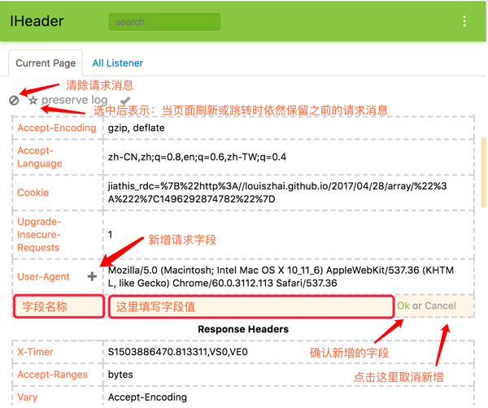
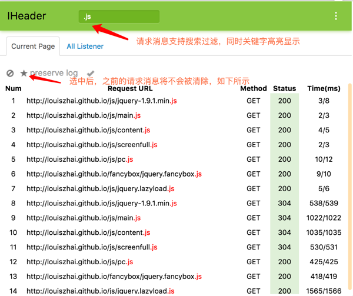

# IHeader


Author: louis

Blog: http://louiszhai.github.io

Github: http://github.com/Louiszhai/IHeader

This extension is mainly used for monitoring and the request and response header of pages, easily add or delete, modify the domain field.

It can be used in the penetration test also.

## Clone

```
git clone git@github.com:Louiszhai/IHeader.git
```

## Install

Open [IHeader - Chrome Webstore](https://chrome.google.com/webstore/detail/iheader/polajedphjkpjbfljoabmcejpcckeked?utm_source=chrome-ntp-icon) to install it.

## Guide

For IHeader extension, Default shortcuts is **`Alt+H`**, press it to switch monitor model. If you forgot shortcut keys, remember there's a right-click menu can do the same thing.

According to my Settings, all requests use the same filter rules. We can customize the filter rules in the options page.

Please be sure to note that when you modify filtering rules, the enabled monitor need to restart to take effect.


When monitor model on, it can catch all requests of current page. As shown below:


From the above list what can you do? You can modify, delete or add some headers to customize it.


You also can clear all request messages and keep the messages when refresh or open new link.



Search is the basic support, matching text will be highlighted.



In addition, there is a tab to show all rules. You can restore your settings here.

Type of "A/M" means increased or modified headers.

Type of "D" means deleted headers.


If you have any questions in use process,  welcome to ask issue to me, enjoy yourself!

## License

Released under [MIT](http://rem.mit-license.org/)  LICENSE.