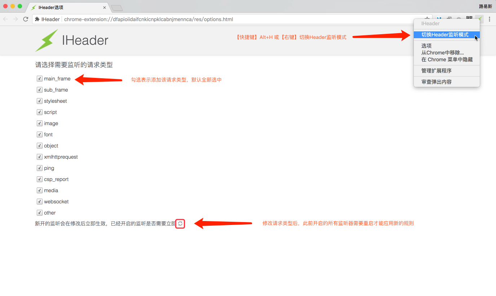
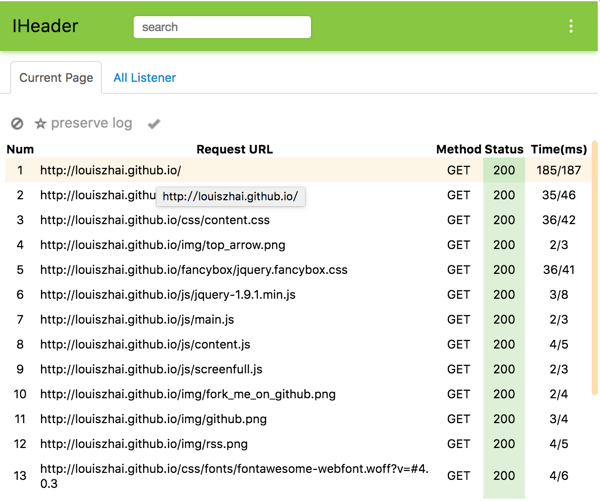

<a target="_blank" href="https://chrome.google.com/webstore/detail/iheader/polajedphjkpjbfljoabmcejpcckeked?utm_source=chrome-ntp-icon"></a>

# IHeader


switch to [README_zh_CN.md](https://github.com/Louiszhai/IHeader/blob/master/README_zh_CN.md)

Author: louis

Blog: http://louiszhai.github.io

Github: http://github.com/Louiszhai/IHeader

This extension is mainly used to monitor the page request and response headers, so as to add, delete, or modify the domain field. Request and response headers field changes comply with the following rules:

> Chrome on request and response headers with clear rules, that is, the console display only send out or just received field. So request after your edit field, the console network bar display properly; and edit the response after field due to do not belong to just the received field, so from the console will can't see the trace of editing, like not modified, actually editing is still valid.

For the request header, **partial Cache related fields**(Authorization、Cache-Control、Connection、Content-
Length、Host、If-Modified-Since、If-None-Match、If-Range、Partial-Data、Pragma、Proxy-
Authorization、Proxy-Connection和Transfer-Encoding) will not appear in the requested information, can be modified by adding the key with the same cover its value, but can't delete it.

For the response headers, can only modify, or delete the cache related field or add fields, due to the response headers allows multiple fields exist at the same time,  so we can not cover and modify the related fields of cache.

## Clone

```
git clone git@github.com:Louiszhai/IHeader.git
```

## Install

Please install it in [IHeader - Google webstore](https://chrome.google.com/webstore/detail/iheader/polajedphjkpjbfljoabmcejpcckeked?utm_source=chrome-ntp-icon).

Or making the source code download, click on the button `Load the unpacked extender` of  `chrome://extensions/` page, select source directory, in order to run on debug mode (because making source code update is timely, therefore recommend this installation).

## Guide

The default shortcut in IHeader extension is  `Alt+H`, press the keyboard shortcuts you can switch the state of monitor in current Tab (open or closed). If you forget shortcuts, remember there's a right-click menu can do the same thing.

According to my set, all requests to use consistent filtering rules, the filtering rules can be set in the options page.

Please note that when you modify filtering rules, the enabled listener need to restart to make new rules take effect. The above content, as shown in the figure below.



After listening on, extension can automatically record the request of the current page, as shown below:



For each request list above, we can add, modify, or delete some HTTP fields to customize it.Custom rules there are two effective ways: (1) the current Tab effectively(default), (2) global effective, as shown below:


In addition, the request list is not always in here, by default, every time a page refresh or jump, previous  request record will be removed, you can use the check boxes to cancel the default action, thus making the request record is preserved. If you want to remove all request record immediately,  just click the remove button below.


Request list support search function at the same time, the match requests will be filtered to show, and the matching text will be highlighted.


In addition, the extension contains another TAB bar to display all the custom rules, you can select a custom rules and remove it. In order to avoid part of the request URL parameter changes cause the failure of listening, you can modify the URL of monitoring on the basis of custom. At present, for matching the request URL, support only contains match(Temporarily no introduction of regular matching, this is in order to avoid the use of complicated and inefficient in regular expressions, which affect the loading request in Chrome).

The following, "A/M" means that the new or modified field(Cache related fields of new and modified scenes are indistinguishable, so combined show).

"A/M" means to delete fields.


In use process if you have any questions, please feel free to give me the issue.

About IHeader development train of thought and the source code parsing, please see [Chrome extension development - HTTP request header field to modify](http://louiszhai.github.io/2017/08/28/iheader/).

## License

Released under [MIT](http://rem.mit-license.org/)  LICENSE.